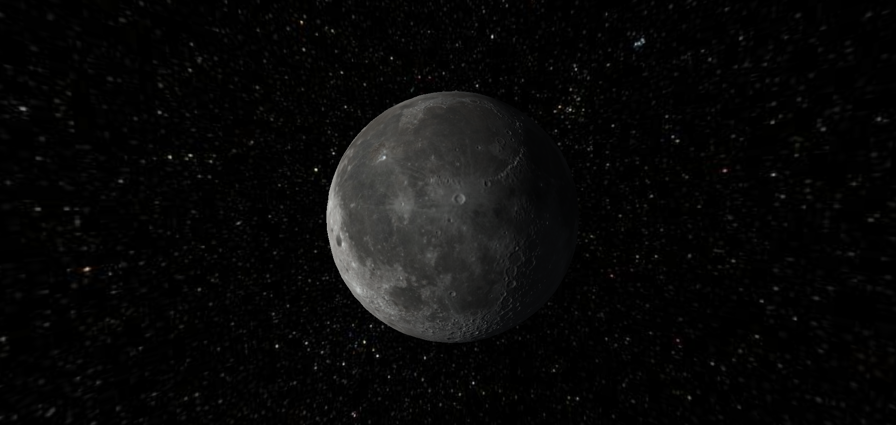

# Three.js Moon in space

## Overview

Greetings! 👋 Dive into the captivating world of Three.js Moon Exploration, a project crafted in just a single day. This web-based creation promises a delightful journey through playful animations, reminiscent of a digital black and white clock with a unique twist.

Whether you're drawn to the design or eager to dissect and experiment with the code, feel free to clone the repository. This engaging yet straightforward project serves as an excellent launchpad for your creative ventures.


## Table of Contents

- [Demo](#demo)
- [Installation](#installation)
- [Technologies Used](#technologies-used)


## Demo

Check out the live demo to see the project in action!

[Live Demo](https://addevin.github.io/moon-three.js/)



## Technologies Used

- HTML
- CSS
- JavaScript
- Three.js


## Installation

Clone the repository and navigate to the project directory. To run the app, open the 'index.html' file in your web browser.

```bash
# Clone the repository
git clone https://github.com/addevin/moon-three.js.git

# Navigate to the project directory
cd moon-three.js

# Run the app:
# Simply open the 'index.html' file in your web browser
```

